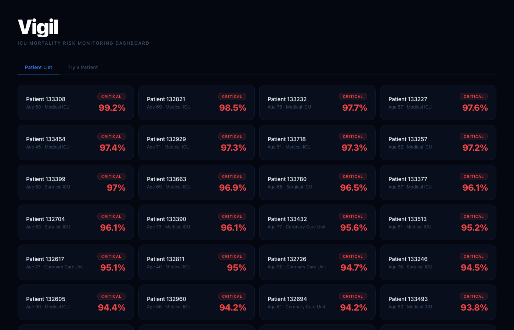

# Vigil

[](https://github.com/kaavyarm/vigil/actions/workflows/ci.yml)

ICU mortality risk prediction and monitoring dashboard built on the [PhysioNet 2012 Challenge](https://physionet.org/content/challenge-2012/1.0.0/) dataset.



## What it does

Vigil ingests 48-hour ICU patient records, engineers time-series features from raw clinical measurements, and predicts in-hospital mortality risk using an XGBoost model. A FastAPI backend serves predictions to a React dashboard that shows:

- **Patient list** — all patients ranked with color-coded risk badges (Low / Moderate / High / Critical)
- **Risk trend** — how predicted mortality risk evolves hour-by-hour as new data arrives
- **SHAP explanations** — top risk factors and protective factors driving each prediction, with human-readable labels
- **Timeline events** — flagged clinical alerts (e.g. low MAP, elevated lactate, mechanical ventilation) with severity and category

## Results

| Model | AUROC | Recall |
|---|---|---|
| SOFA score (clinical baseline) | 0.648 | — |
| SAPS-I score (clinical baseline) | 0.672 | — |
| Logistic Regression | 0.856 | 0.784 |
| Random Forest | 0.861 | 0.324 |
| **XGBoost (deployed)** | **0.878** | **0.496** |
| XGBoost (tuned, higher AUROC) | 0.884 | 0.405 |

The deployed model clears the clinical baseline by ~0.21 AUROC. 5-fold stratified cross-validation mean: **0.842 ± 0.013**.

The hyperparameter-tuned variant achieves marginally higher AUROC but recall drops from 0.496 to 0.405 — meaning it misses ~10% more deaths. In a clinical monitoring context, a false alarm is far less costly than a missed deterioration, so the higher-recall model is deployed.

## Stack

| Layer | Tech |
|---|---|
| Data pipeline | Python, pandas, NumPy |
| ML | XGBoost, scikit-learn, SHAP |
| Backend | FastAPI, Uvicorn |
| Frontend | React, Recharts |
| Model storage | joblib |

## Project structure

```
vigil/
├── src/                           # Runtime library (imported by backend)
│   ├── process_one_patient.py     # Parse raw PhysioNet .txt → structured dict
│   ├── feature_engineering.py     # Extract 263 features per patient
│   ├── explain_model.py           # SHAP-based per-patient explanations
│   ├── risk_trend.py              # Temporal risk snapshots at 6h intervals
│   └── timeline_events.py         # Rule-based clinical alert detection
├── scripts/                       # One-time pipeline scripts (ETL + training)
│   ├── process_all_patients.py    # Run parser across full dataset
│   ├── build_feature_table.py     # Assemble full feature matrix
│   ├── merge_outcomes.py          # Join with mortality outcomes
│   └── train_model.py             # Train + CV + hyperparameter search + save
├── backend/
│   └── app/main.py                # FastAPI REST API
├── frontend/
│   └── src/
│       ├── App.jsx                # Patient list + dashboard views
│       └── api.js                 # Fetch helpers
├── data/
│   ├── processed/patients/        # Per-patient JSON files
│   └── features/                  # Engineered feature matrix
└── models/                        # Saved model + feature metadata
```

## Setup

**Requirements:** Python 3.10+, Node 18+

### 1. Python environment

```bash
python -m venv .venv
source .venv/bin/activate
pip install -r requirements.txt
```

### 2. Data

Download [PhysioNet 2012 Challenge](https://physionet.org/content/challenge-2012/1.0.0/) and place Set A under `data/raw/Set A/`.

### 3. Run the pipeline

```bash
python scripts/process_all_patients.py
python scripts/build_feature_table.py
python scripts/merge_outcomes.py
python scripts/train_model.py
```

### 4. Start the backend

```bash
uvicorn backend.app.main:app --reload --port 8001
```

### 5. Start the frontend

```bash
cd frontend
npm install
npm run dev
```

Open [http://localhost:5173](http://localhost:5173).

### 6. Run tests

```bash
pytest
```

76 tests across feature engineering, clinical alert logic, label formatting, and API endpoints.

## Feature engineering

Each patient record is a time series of clinical measurements over 48 hours. For each of 32 parameters (HR, MAP, GCS, Lactate, Creatinine, etc.), Vigil extracts:

- **Summary statistics** — mean, min, max, last observed value, std, count
- **Trend** — linear slope over time (positive/negative trajectory)
- **Missingness flag** — whether the parameter was ever measured (clinically meaningful)
- **Domain-specific** — total urine output, mechanical ventilation flag

This produces 263 features per patient. SAPS-I and SOFA scores are withheld from model features and used only as baselines to avoid leakage.
